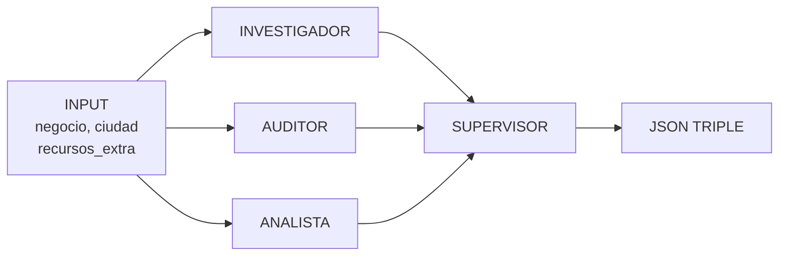

# 🏗️ ESQUEMA COMPLETO DE AGENTES

## 📋 Tabla de Contenidos
1. [Resumen Ejecutivo](#resumen-ejecutivo)
2. [Los 4 Agentes](#los-4-agentes)
3. [Flujo de Ejecución](#flujo-de-ejecución)
4. [Estructura del Resultado](#estructura-del-resultado)
5. [Interconexiones](#interconexiones)

---

## Resumen Ejecutivo

El sistema es un **orquestador de 4 agentes especializados** que funcionan en paralelo usando **CrewAI** y **Ollama** como LLM:

```
Auditor de Huella Digital
│
├─ Investiga reputación web
├─ Audita Google Maps + Redes Sociales
├─ Analiza competencia local
└─ SUPERVISOR sintetiza todo en JSON comercial
```

**Cada agente**:
- Tiene un ROL específico (Investigador, Auditor, Analista, Supervisor)
- Tiene un GOAL único
- Cuenta con HERRAMIENTAS especializadas (MCP)
- Genera OUTPUT que alimenta al Supervisor

---

## Los 4 Agentes

### 1️⃣ INVESTIGADOR DE IDENTIDAD CORPORATIVA

```yaml
Rol: "Investigador de Identidad Corporativa"
Goal: "Encontrar menciones, reputación y presencia general"
Herramientas:
  - buscar_presencia_web
LLM: Ollama (local o qwen3-coder-next:cloud)
AllowDelegation: false
Verbose: true
```

**¿Qué busca?**
- Menciones en directorios online
- Noticias donde aparece la marca
- Reputación pública
- Consistencia de marca en la web

**Input**: `nombre_negocio`, `ciudad`

**Output**: 
```
"Resumen de menciones web y reputación: 
 - Aparece en 3 directorios locales
 - 2 noticias positivas en 2023
 - Menciones en foros con calificación X
 - Branding consistente: Sí/No"
```

---

### 2️⃣ AUDITOR DE HUELLA DIGITAL

```yaml
Rol: "Auditor de Huella Digital para PYMES"
Goal: "Auditar técnicamente Google Maps y Redes Sociales"
Herramientas:
  - buscar_negocio_huella (Google Maps)
  - verificar_redes_huella (Instagram/Facebook)
LLM: Mismo LLM que Investigador
AllowDelegation: false
Verbose: true
```

**¿Qué valida?**
- ✓ Google My Business: ubicación, fotos, horario, descripción
- ✓ Instagram: oficial vs fake, biografía, links, posts recientes
- ✓ Facebook: página oficial, info de contacto, reseñas
- ✗ Enlaces rotos, información desactualizada
- ⚠️ Score técnico (0-100): basado en completitud

**Input**: `nombre_negocio`, `ciudad`

**Output**:
```
"Auditoría detallada: 
 - GMB: Activo, 4.8⭐, 234 reseñas, fotografía completa
 - Instagram: Oficial encontrada, 2.1K followers, posts activos
 - Facebook: Página activa, actualizaciones recientes
 - Score tentativo: 78/100"
```

---

### 3️⃣ ANALISTA DE COMPETENCIA B2B

```yaml
Rol: "Analista de Competencia Local"
Goal: "Analizar 3 competidores directos"
Herramientas:
  - buscar_competidores_huella
LLM: Mismo LLM que los anteriores
AllowDelegation: false
Verbose: true
```

**¿Qué analiza?**
- Top 3 competidores en la misma categoría + ciudad
- Ratings y cantidad de reseñas
- Presencia digital (Instagram, Facebook, sitio web)
- Puntos fuertes del competidor
- Brechas vs el cliente

**Input**: `categoria_negocio`, `ciudad`

**Output**:
```
"Análisis de Competencia:
 1. Competidor A: 4.9⭐, 580 reseñas, sitio web + Instagram + FB
 2. Competidor B: 4.7⭐, 420 reseñas, Instagram activo
 3. Competidor C: 4.5⭐, 290 reseñas, básico
 
 Nuestro cliente está EN LÍNEA con competencia, ligeramente atrás en reviews"
```

---

### 4️⃣ SUPERVISOR: INGENIERO DE AUTOMATIZACIÓN

```yaml
Rol: "Ingeniero de Automatización y Director Comercial"
Goal: "Sintetizar investigación + auditoría + competencia → JSON triple"
Herramientas: NINGUNA (consume resultados de otros 3 agentes)
LLM: Mismo LLM
AllowDelegation: false
Verbose: true
Context: [tarea_investigacion, tarea_auditoria, tarea_competencia]
```

**¿Qué sintetiza?**
- Recibe expedientes de los 3 agentes
- Crea propuesta comercial
- Genera JSON para 3 audiencias diferentes
- Sugiere flujos de automatización n8n

**Output**: JSON estricto con 3 bloques

---

## Flujo de Ejecución

### Fase 1: Ejecución Paralela (o secuencial según CrewAI)

```
             INPUT: {negocio, ciudad, recursos_extra}
                           │
                ┌──────────┼──────────┐
                │          │          │
                ↓          ↓          ↓
           INVESTIGA  AUDITA      ANALIZA
            (web)    (mapas+      (compe-
                     redes)       tencia)
                │          │          │
                └──────────┼──────────┘
                           ↓
                    OUTPUT x3
                    (expedientes)
                           │
                           ↓
                      SUPERVISOR
                   (síntesis JSON)
                           │
                           ↓
                      JSON FINAL
            {cliente_gancho, interno_mercadologa, 
             interno_ingeniero}
```

### Fase 2: Creación de Crew (CrewAI)

```python
crew = Crew(
    agents=[
        investigador_marca,      # Agent 1
        auditor_huella,          # Agent 2
        analista_competencia,    # Agent 3
        estratega_supervisor     # Agent 4
    ],
    tasks=[
        tarea_investigacion,     # → Output: reputación
        tarea_auditoria,         # → Output: auditoría técnica
        tarea_competencia,       # → Output: análisis comparativo
        tarea_supervision        # → Input: los 3 anteriores
                                 # → Output: JSON triple
    ],
    verbose=True,
    memory=True/False  # Depende de modo (producción vs local)
)
```

### Fase 3: Ejecución del Crew

```python
resultado = crew.kickoff(inputs={
    "negocio": "Pizzería La Roma",
    "ciudad": "Monterrey, Nuevo León",
    "recursos_extra": "Instagram: @romamx"
})
```

---

## Estructura del Resultado

### JSON FINAL (Output del Supervisor)

```json
{
  "cliente_gancho": {
    "score": 72,
    "resumen_ejecutivo": "Tu negocio tiene una buena base digital pero está detrás de la competencia en presencia social...",
    "puntos_dolor_urgentes": [
      "Google Maps sin fotos de interior",
      "Instagram sin publicaciones en 6 meses",
      "Sin sitio web oficial"
    ],
    "plataformas_encontradas": {
      "instagram": true,
      "facebook": true,
      "sitio_web": false,
      "google_maps": true
    }
  },
  
  "interno_mercadologa": {
    "analisis_competencia": "El competidor A tiene 2x más reviews. Está invirtiendo en redes sociales. Nosotros podemos ofertar...",
    "estrategia_recomendada": "1. Crear contenido visual para Instagram, 2. Activar Facebook con promociones, 3. Optimizar GMB",
    "servicios_a_ofrecer": [
      "Auditoría digital ($500)",
      "Gestión Instagram + Facebook (plan mensual)",
      "Optimización Google My Business ($300)",
      "Creación de sitio web ($2000)"
    ]
  },
  
  "interno_ingeniero": {
    "viabilidad_automatizacion": "Altamente viable. El cliente puede automatizar respuestas de reseñas y captura de leads.",
    "flujos_n8n_sugeridos": [
      "Auto-responder a reseñas negativas con plantillas de disculpa",
      "Webhook para capturar leads del formulario de contacto",
      "Publicar automáticamente stories en Instagram (si proporcionan contenido)",
      "Sincronizar reseñas de GMB a base de datos CRM"
    ]
  }
}
```

---

## Interconexiones

### Cómo cada Agente recibe contexto



### Orden de Ejecución de Tareas

CrewAI ejecuta las tareas **en orden**, pero los primeros 3 agentes son **independientes**:

```
Tarea 1: Investigación     (Investigador)
Tarea 2: Auditoría         (Auditor)        ← Paralelo con Tarea 1
Tarea 3: Competencia       (Analista)       ← Paralelo con Tareas 1 y 2
Tarea 4: Supervisión       (Supervisor)     ← Espera Tareas 1, 2 y 3
                           context=[T1, T2, T3]
```

---

## 🔧 Configuración del LLM

### Variables de Entorno
```env
LOCAL_LLM_BASE_URL=http://localhost:11434/v1
LOCAL_LLM_MODEL=llama3.1:8b           # Local
# LOCAL_LLM_MODEL=qwen3-coder-next:cloud  # Producción
OPENAI_API_BASE=http://localhost:11434/v1
OPENAI_API_KEY=not-needed
```

### Parámetros del LLM
```python
LLM(
    model="llama3.1:8b",
    base_url="http://localhost:11434/v1",
    temperature=0.01,   # Muy bajo para tool-calling estable
    top_p=0.9,
    timeout=120,
    max_tokens=2048
)
```

---

## 📚 Archivos Asociados

| Archivo | Contenido |
|---------|-----------|
| `agente.py` | Setup de Crew + definición de Agentes y Tareas |
| `system_prompts/investigador.md` | Backstory del investigador (cómo debe pensar) |
| `system_prompts/auditor.md` | Backstory del auditor |
| `system_prompts/analista.md` | Backstory del analista |
| `system_prompts/supervisor.md` | Backstory del supervisor |
| `context/reglas_auditor.md` | Reglas globales aplicadas a todos los agentes |
| `servidor_mcp.py` | Herramientas (tools) disponibles para agentes |
| `main.py` | Punto de entrada (GUI o CLI) |
| `gui.py` | Interfaz gráfica CustomTkinter |

---

## 🎯 Resumen Final

```
┌────────────────────────────────────────────┐
│        AUDITOR DE HUELLA DIGITAL            │
│                                             │
│  4 Agentes Especializados (CrewAI)         │
│  ├─ Investigador   (reputación web)        │
│  ├─ Auditor        (mapas + redes)         │
│  ├─ Analista       (competencia)           │
│  └─ Supervisor     (síntesis + JSON)       │
│                                             │
│  Output: JSON Triple para 3 audiencias     │
│  1. Cliente (score + urgencia)             │
│  2. Marketing (servicios a vender)         │
│  3. Ingeniero (flujos n8n)                 │
└────────────────────────────────────────────┘
```

**La clave**: Cada agente es un especialista independiente que contribuye con su perspectiva. El Supervisor sintetiza todo en una propuesta comercial viable.
